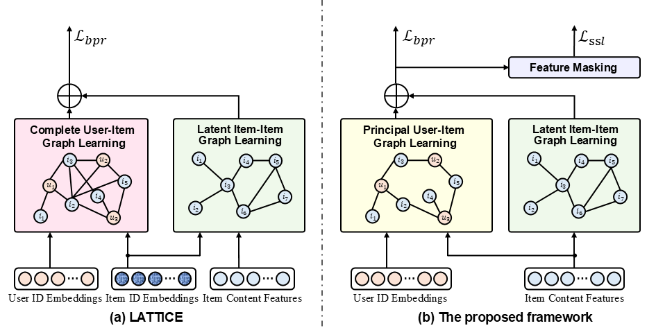
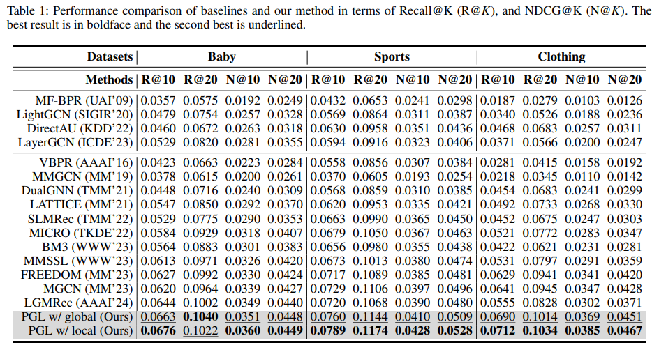

# Mind Individual Information! Principal Graph Learning for Multimedia Recommendation

## Introduction

This is the Pytorch implementation for our AAAI 2025 paper [Oral Paper]:

>AAAI 2025. Penghang Yu, Zhiyi Tan, Guanming Lu, Bing-Kun Bao(2025). Mind Individual Information! Principal Graph Learning for Multimedia Recommendation


## Enviroment Requirement
- python 3.8
- Pytorch 1.12

## Dataset
We provide three processed datasets: Baby, Sports and Clothing.
Download from Google Drive: [Baby/Sports/Clothing](https://drive.google.com/file/d/1tpP-IQtUubSlVvYpkA61bffPKkhvT62T/view?usp=drive_link)

## Training
  ```
  cd ./src
  python main.py
  ```
## Performance Comparison


## Citing MGCN
If you find PGL useful in your research, please consider citing our [paper](https://doi.org/10.1609/aaai.v39i12.33429).
```
@article{yu2025pgl,
  title={Mind Individual Information! Principal Graph Learning for Multimedia Recommendation},
  author={Yu, Penghang and Tan, Zhiyi and Lu, Guanming and Bao, Bing-Kun},
  booktitle={Proceedings of the 31st ACM International Conference on Multimedia},
  volume={39},
  number={12},
  journal={Proceedings of the AAAI Conference on Artificial Intelligence},
  year={2025},
  pages={13096-13105}
}
```
The code is released for academic research use only. For commercial use, please contact [Penghang Yu](y463213402@gmail.com).

## Acknowledgement
The code is based on [MMRec](https://github.com/enoche/MMRec). Thank for their work.
